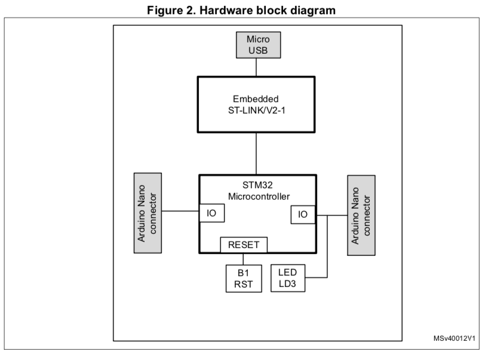
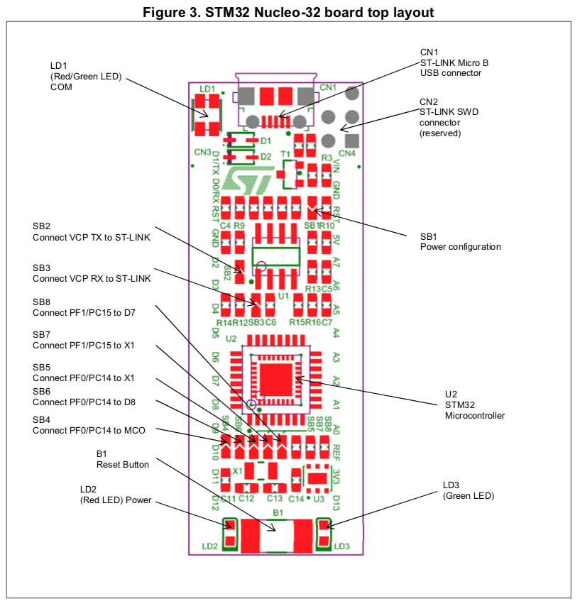
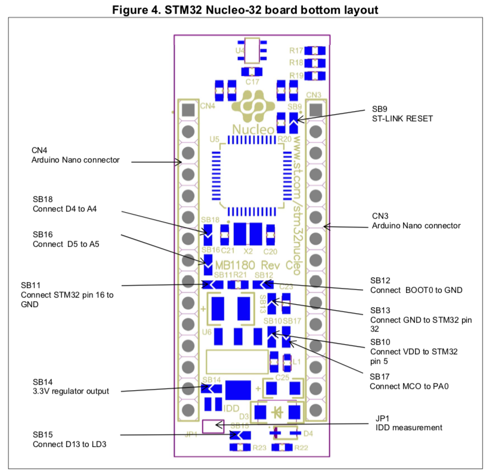
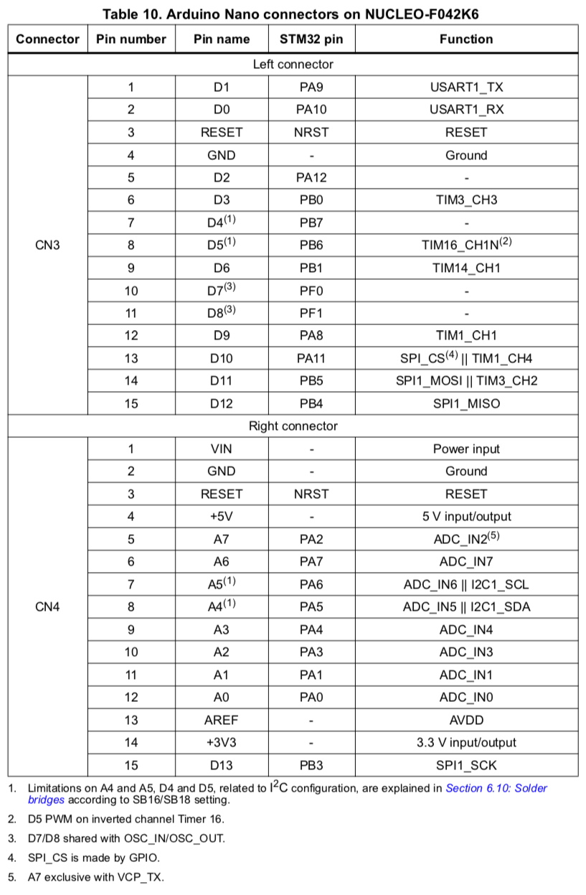
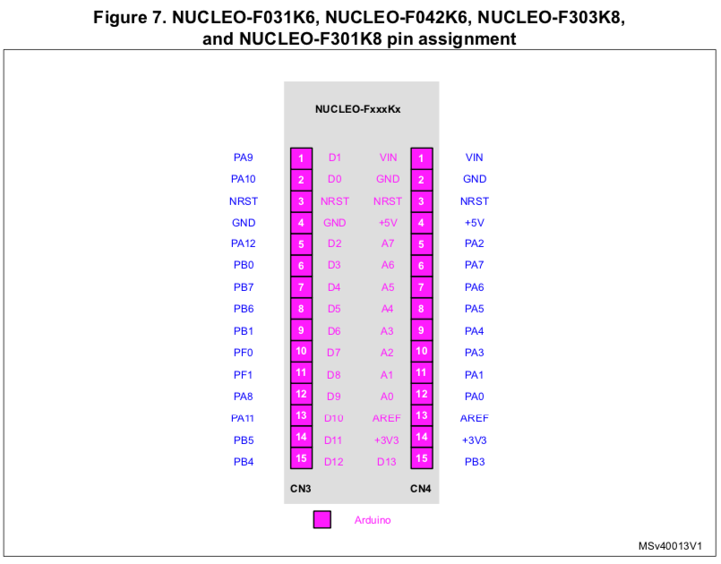

# Nucleo F042K6

* 基本的な設定は [F041K6](../Nucleo-F401RE) と同じ
* ユーザボタンのかわりにジャンパーになっている。
* Mac/Windowsでも正しく認識する模様。ケーブルか基板の問題か？

# ボードとピンレイアウト
* [UM1956 User manual STM32 Nucleo-32 boards (MB1180)](https://www.st.com/resource/en/user_manual/dm00231744-stm32-nucleo32-boards-mb1180-stmicroelectronics.pdf)

* PB3(D3)は緑色LED(LD3)に接続
* デフォルトではPA12(D2)とGNDに黒のピンヘッダ・ジャンパーがある。デフォルトのソフトウェアでは抜くとLD3の点滅が早くなる。

