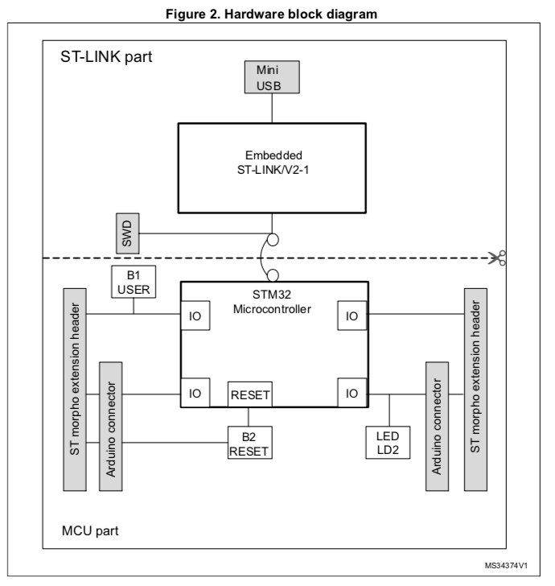
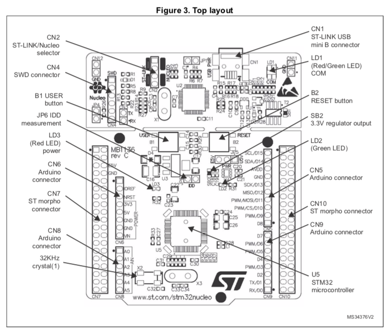
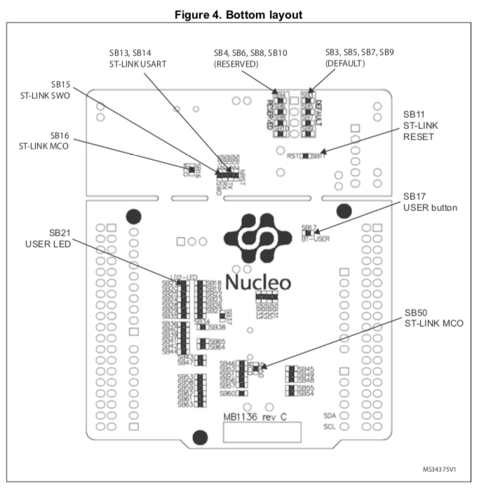
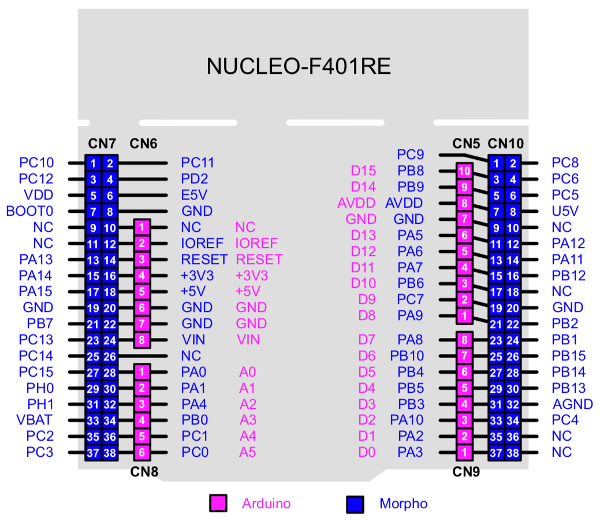

# STM32 Nucleo F401RE

* STM32 Nucleo F401REを使った基本的な動作確認
* CubeMXで生成されるHALライブラリを使用する
* gccおよびMakefileを利用
* CubeMXで自動生成されたフォルダはできるだけ触らず、外側から参照するようにする(CubeMXの下位フォルダが生成されたもの)
* 開発環境などは[こちらを参照](../DevEnv.md)

### CubeMXをつかった初期コードの生成

すでにサンプルのビルドに必要な CubeMXからのは生成ずみだが、以下の方法で新規にコードを生成できる。

1. CubeMXを起動
2. "Start My project from STBoard" を起動
3. Part Number Search に NUCLEO-F401RE を入力しEnter
4. NUCLEO-F401RE をクリックし、Start Project
5. Initalize all peripherials with their default Mode ? と聞いてくるので Yes
6. 好きなピンやベリフェラルを選んで設定
7. Project Manager を選ぶ
8. Project Locationに[CubeMX](./CubeMX)フォルダを選択
9. Project Nameに任意の名前を選択
10. ProjectのToolchain/IDEでMakefileを選択
11. Generate Codeを押す

### Nucleo F401REはSTM32F401xD/xE とどのように繋がっているのか？

[UM1724 STM32 Nucleo-64 boards User Manual](https://www.st.com/resource/en/user_manual/dm00105823-stm32-nucleo64-boards-mb1136-stmicroelectronics.pdf)

* ボード上緑LED(LD1) は PA5に接続
* ボード上青ボタン(B1) は PC13に接続
* USART\_TX(PA2)とUSART\_RX(PA3) は ST-LinkのVirtual COM Portに接続

### Linux(Raspberry Pi Raspbian)での認識

* Nucleoボードの上部分はST-Linkになっていて、ジャンパを変更すると素のSTM32のプログラマとして機能する
* Rasbperry Piに接続すると、STMicroelectronics ST-LINK/V2.1 として認識される
* マスストレージデバイス MBED が認識される
* Virtual COM Port /dev/ttyACM0 が認識される
* st-info --probe でボード情報が表示される（なぜか実行するとマイコンの動作がとまるが、st-info --serial を実行すると動き出す)
* ここではttyACM0への接続にscreenを利用する、終了はCTRL+A, k → y
* 私の場合macOSだとVCPデバイスが認識できず(ストレージの認識とプログラムはできる)、Windowsだとデバイスがうまく認識できなかった。

#### アプリケーションのビルドとアップロード例

	$ cd Nucleo-F401RE/01-blink
	$ make all
	$ make flash

